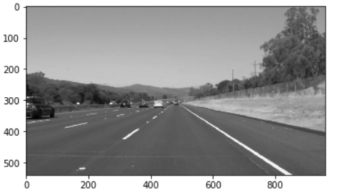
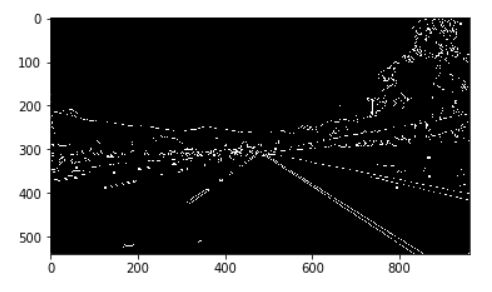
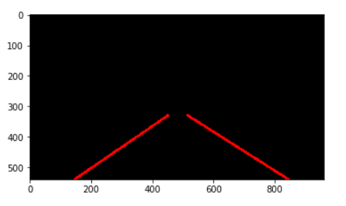
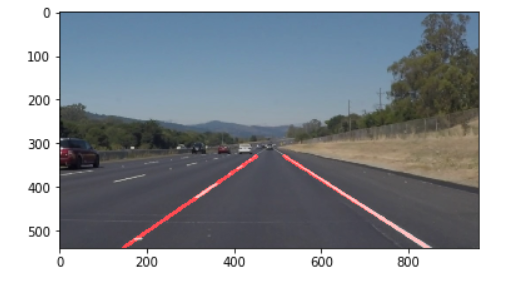

# **Finding Lane Lines on the Road** 

## By Rohit Kukreja

---

**Finding Lane Lines on the Road**

The goals / steps of this project are the following:
* Building a pipeline that finds lane lines on the road
* Trying the pipeline on real videos

**Youtube video**

[//]: # (Image References)

[grayscale]: ./test_images_output/grayscale.PNG "grayscale"
[hough]: ./test_images_output/hough.PNG "hough"
[canny]: ./test_images_output/canny.PNG "canny"
[result]: ./test_images_output/final.PNG "final"
[roi]:  ./test_images_output/region.PNG "reegion of intrest"
---

### Pipeline Overview

### 1. Pipeline description

### My pipeline consisted of the following steps:
- Convert to grayscale: 
	* We process the image or frame within the video by changing colorful images to grayscale.
	* Each pixel can now be represented by a 8-bit integer number(0-255) 
	
    	

		
	    

 
- Smoothing:
    *  Gaussian smoothing is used to removed unwanted noise in the image since in the next step we want to detect edges
    *  We consider kernel size of 5x5.
    
- Canny Edge Detection::
    *  Lanes have different color from its neighboring hence a state of art algorithm Canny edge detection is applied on the Gaussian smoothed image to detect relevant edges in the image.
    
    
	    

		
	    

	    
- Region of interest:
    *  In previous step we get a lot edges over the image but since we are interested only in the lanes in image hence we restrict ourselves over a small portion of images known as region of interest
    *  A quadrilateral of interested width and height is selected to detect only the road lane marking.
    
    
	    

		
	    

- Hough transform:
    *  Previous steps gives us many points as edges of lane but we are more interested in continuous edge line. 
    *  We find a line passing through all those points thus we use hough transformation to find a set of continuous lines .
    
    
	    

		
	    

	 

Mapping of hough image on original image is done to achieve the final lane detected image.
    

	
	

![Pipeline flow][flow]

### 2. Potential shortcomings with my current pipeline

This pipeline is not robust to the following conditions :

* If there is huge amount of noise in the region of interest (edges which are not produced from the lanes), the algorithm\
  cannot decide which one represent the lines
* Drastic changes in the lanes direction, if we are driving around twisty roads, this system won't be capable\
  to detect the lines, since we are using averages from the past frames,and also the drastic changes will be considered\
  as an outliers(noise)
  
### 3. Possible improvements to my pipeline

* We can obtain some slight improvements if we use Linear regression or for example Nearest Neighbour heuristic can help to find the hough point that has the most neighbours, so we can draw that point instead of calculating average, but it won't solve the main problems above.
* A possible solution would be the using of non-linear models that can learn how one lane is represented in the road, considering not only the edges, but many features as well.\
I think that Neural networks, especially Convolutional Neural Networks can be trained to get all
the regions(anchors) representing the lanes, so we draw curve among the anchors, with using spline interpolations or similar numeric methods.
* I think that this model will solve the shortcomings mentioned before, the best power is that we can train the model
  with data generated from different conditions with different type of noise,\
  so our system can be more robust and if properly trained, it can adapt to all drastic changes that can happen.

